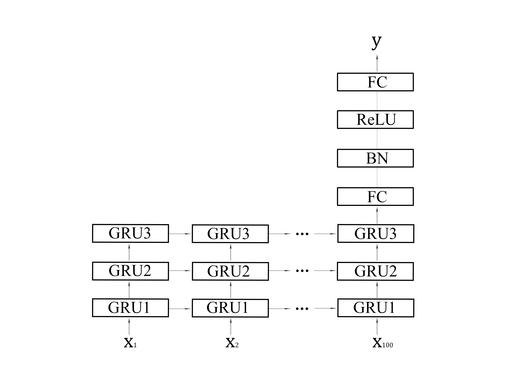

# Introduction (our work)

We use a deep learning network Gated Recurrent Unit (GRU) to analyze functional magnetic resonance imaging (fMRI) data from the human brain at rest to estimate the age of the subject.

## Data Sources

We train our model using 795 publicly available fMRI images at rest.
There are 26 projects.
Among them, 25 projects are from the [1000 Functional Connectomes Project](http://fcon_1000.projects.nitrc.org/fcpClassic/FcpTable.html).
The remaining project has 369 samples from the [Southwest University Adult Lifespan Dataset](http://fcon_1000.projects.nitrc.org/indi/retro/sald.html).

## Tool

We use the FMRIB software library (FSL) to preprocess fMRI data.
And we write our GRU model using PyTorch.

### FSL

FSL is widely used analytical tool library for brain imaging data such as fMRI, MRI and DTI.
It can be used on Mac and PCs (both Linux, and Windows via a Virtual Machine).
Detailed installation tutorial reference [FSL website](https://fsl.fmrib.ox.ac.uk/fsl/fslwiki/).

## Data Preprocessing

We set the processing parameters according to each project.
First, use FEAT of FSL to process a random sample of each project and extract the parameters. 
These parameters are used to normalize the rest of the data in the project.
This part is only for standardizing images.
And it corresponds to the [fsl_in_linux.py](https://github.com/gyfbianhuanyun/brain-data-with-age/blob/master/fsl_in_linux.py).

```
1.Process a random sample to get design.fsf
2.Use our code to normalize the rest of the data in the project

For example：
project_namelist = file_name('/Documents')
for i in range(1, 30):
    project_name = project_namelist[i]
    file_namelist = file_name(f'/{project_name}')
    first_name = file_namelist[0]
    func_fsl(project_name, file_namelist, first_name)
```

Then we register the data on the the Montreal Institute of Neurology (MNI) brain space Automated Anatomical Labeling atlas (AAL2).
The FMRIB Linear Image Registration Tool (FLIRT) is used for registration to divide the brain into 94 regions.
This part corresponds to the [comparision.py](https://github.com/gyfbianhuanyun/brain-data-with-age/blob/master/comparision.py).

```
1.Get the project name
2.Use our code to register the data on the AAL2

For example：
project_namelist = file_name('/Documents')
for project_name in project_namelist:
    file_namelist = file_name(f'/Documents/{project_name}')
    for name in file_namelist:
        comparision(project_name, name)
```

## Our model structure

First, three layers of GRU take an input where each GRU has 300 hidden states.
The last GRU is followed by a fully connected (FC) layer.
Then, we add a batch normalization (BN) layer and ReLU activation.
Finally, the final FC layer estimates the age.
We use the mean square error method to calculate the loss while training.


## Authors

Created by Yunfei Gao and Albert No at Hongik University.
For more information, please refer to the paper 'Age Estimation From fMRI Data Using Recurrent Neural Network'.
